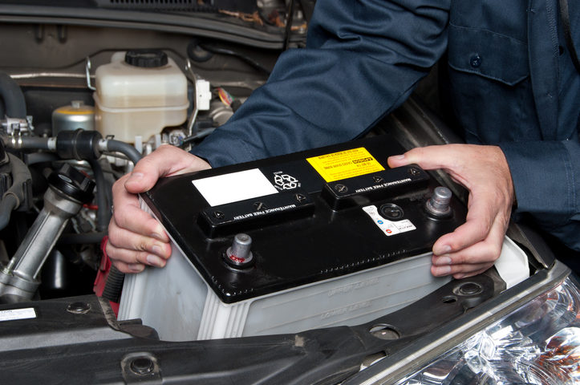

# Eletricidade e Eletrónica

Diagnóstico e substituição de baterias, alternadores e lâmpadas.

A bateria é o elemento principal do circuito eléctrico da sua viatura, mas desgasta-se e perde a sua eficácia passados alguns anos. A sua função é armazenar a energia elétrica para permitir o funcionamento ideal de todos os elementos de segurança e de conforto.

## **Serviços que Oferecemos:**

**Teste e Diagnóstico de Bateria:**

- Realizamos testes avançados para avaliar o estado da sua bateria e prevenir falhas inesperadas.
- Diagnóstico preciso para identificar problemas e garantir uma performance ótima.

**Substituição de Baterias:**

- Oferecemos uma variedade de baterias de alta qualidade, compatíveis com diversas marcas e modelos.
- Substituição profissional, assegurando uma partida confiável em todas as condições.

**Manutenção e Limpeza:**

- Proporcionamos serviços de manutenção e limpeza para prolongar a vida útil da sua bateria.
- Verificação de terminais, limpeza de corrosão e ajustes para garantir uma conexão elétrica sólida.

Confie-nos o cuidado da bateria do seu veículo para garantir partidas seguras e sistemas elétricos em pleno funcionamento, permitindo-lhe enfrentar qualquer jornada com confiança.

