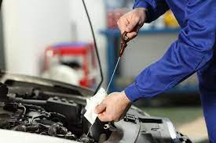

# Mudança de Óleo

O óleo é importante para um bom funcionamneto do veículo.

## **Por Que a Troca de Óleo é Vital:**

1. **Proteção do Motor:**
O óleo adequado forma uma barreira protetora no motor, reduzindo o desgaste e prolongando a vida útil do mesmo.

2. **Eficiência de Combustível:**
Uma troca regular de óleo contribui para a eficiência do combustível, poupando dinheiro a longo prazo.

3. **Redução de Emissões:**
O óleo limpo tem papel crucial na redução das emissões prejudiciais ao ar e no respeito pelo ambiente.

## **Compromisso com a Qualidade:**

Comprometemo-nos a fornecer não apenas serviços, mas uma experiência educativa que te capacitará a tomar decisões informadas sobre a manutenção do teu veículo. Navega pelo nosso site e descobre como a troca de óleo pode ser mais do que uma tarefa de rotina - é um investimento no futuro do teu automóvel.

Confia em nós para cuidar do teu veículo como se fosse nosso. Juntos, garantimos uma jornada suave, quilómetro após quilómetro.

